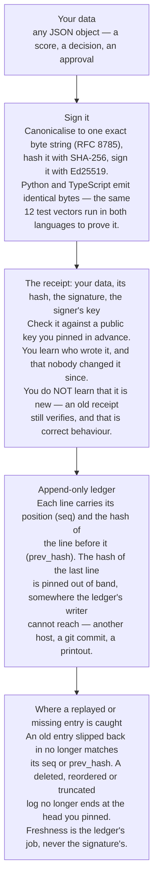

# avow

**Sign a record of what your software decided, then verify it offline — on someone else's
machine, years later, with no access to your database.** Edit one character of the record
and verification fails.

## Proof

A real session. `avow` 0.2.0 from PyPI on Python 3.13.14; output copied verbatim, including
the failure.

```console
$ assay keygen --out signing.key
wrote signing key: signing.key
wrote public key: signing.key.pub

$ echo '{"metric":"binary","metric_version":"1","y_true":[0,1,0,1],"y_score":[0.2,0.8,0.3,0.7]}' > req.json

$ assay score --request req.json --key signing.key --out receipt.json --ledger ledger.jsonl
wrote receipt: receipt.json
wrote ledger head: ledger.jsonl.head (1 entries)

$ tail -4 receipt.json
  "payload_hash": "sha256:a2ada15199d7586958d9754a4adeba4d13a4e73122f9604f65a536fb4a4bad7e",
  "public_key": "cfcc49b01cc3019ce451a1bde8a146fbe423682faa2a2c7d0d0f0a01da008292",
  "signature": "3cb2ae7edb1831ef47246cb0f07854a6a63aa9ba5457659455532dfc972758b4aaa1f73912b041a8606cb6b7d413bbc77defd6b2141a2aa50325d139f9143804"
}

$ assay verify --receipt receipt.json --public-key signing.key.pub; echo "exit $?"
OK: receipt verified
exit 0

$ sed 's/"abstained": true/"abstained": false/' receipt.json > tampered.json

$ diff receipt.json tampered.json
10c10
<     "abstained": true,
---
>     "abstained": false,

$ assay verify --receipt tampered.json --public-key signing.key.pub; echo "exit $?"
FAIL: avow.replay_mismatch: payload hash does not match payload content
exit 1
```

Four samples is below the sample-size floor, so the receipt honestly recorded
`"abstained": true` and no score. The `diff` is the entire edit: one word, turning an
abstention into a confident answer — the sort of quiet correction that leaves no trace in
an ordinary database. The signature bytes were never touched. It still fails, because the
payload no longer hashes to the value the signature covers.

> The code above reads `avow.replay_mismatch`, which is what 0.2.0 prints. It is a
> misnomer: this is a **tamper** failure, and the envelope detects no replay at all. It is
> renamed `avow.payload_hash_mismatch` on `main` and ships in 0.3.0, with `ReplayMismatch`
> kept as a deprecated alias. See [Honest limits](#honest-limits).

## Run it

```bash
# The PyPI distribution is `avow`. The command it installs is `assay`. There is no `avow`
# command, and this project does not publish a distribution called `assay` —
# `pip install assay` gets an unrelated package by another author.
python3.13 -m venv .venv && . .venv/bin/activate    # Python 3.13+ is required
pip install 'avow[cli]'

assay keygen --out signing.key
echo '{"metric":"binary","metric_version":"1","y_true":[0,1,0,1],"y_score":[0.2,0.8,0.3,0.7]}' > req.json
assay score --request req.json --key signing.key --out receipt.json --ledger ledger.jsonl
assay verify --receipt receipt.json --public-key signing.key.pub            # exit 0
sed 's/"abstained": true/"abstained": false/' receipt.json > tampered.json
assay verify --receipt tampered.json --public-key signing.key.pub           # exit 1
```

---

## Why this exists

Your card gets declined at a checkout.

You call the bank and ask why. Someone reads a reason off a screen: the fraud system
scored the transaction as risky, so it blocked it.

But that reason is just a row in a database. Rows can be changed. Nobody — not you, not
the bank's own auditor, not a regulator — can tell whether that number is what the
software actually produced at the moment it blocked your card, or whether somebody
adjusted it afterwards, once you complained.

That is the gap `avow` closes. When your software makes a decision, avow has it write a
**receipt**: a small record of exactly what was decided, sealed with cryptography at the
moment of the decision. Think of a store receipt — except this one cannot be reprinted or
altered. Hand it to anyone; they check it on their own laptop, offline, with no access to
your database, and get **valid** (this is exactly what the software decided, byte for byte)
or **invalid** (someone changed it). There is no "close enough".

## Two layers, and why the difference matters



The first three boxes are the envelope; the last two are the ledger. The npm package
`@edgeproc/avow` ships the envelope (canonical bytes and sign/verify) **plus the metrics
that go inside a receipt** — recall@k, precision@k, F1@k, MRR and the binary confusion
set, giving the same answers as the Python `assay` face. It does not ship the ledger, so
a browser gets tamper-evidence, not replay defence; the ledger is Python-side
(`avow.ledger`).

## The names, spelled out

Three names get confused, and two of them belong to other people's packages:

| You type | What you get |
|---|---|
| `pip install avow` | **this project** — the envelope, importable as `avow` |
| `pip install 'avow[cli]'` | this project plus the `assay` command used above |
| `npm i @edgeproc/avow` | **this project** — the TypeScript envelope + metrics |
| `pip install assay` | *someone else's* — Brandon Rhodes' "Future testing framework" |
| `npm i assay` | *someone else's* — Nathan Zadoks' assertion helper |

So: the distribution is `avow`, the command is `assay`, and `import avow` / `import assay`
both come out of the single `avow` install. There is no `avow` command.

One more thing that will otherwise trip you up: **Python 3.13 or newer is required.** On
3.12 or older `pip install avow` fails while resolving, with a message that does not
mention the Python version. Check with `python --version` first.

## The same thing from Python

```python
from pydantic import BaseModel, ConfigDict

from avow import generate_signing_key, public_key_hex, sign_payload, verify_signature


class FraudCheck(BaseModel):
    model_config = ConfigDict(frozen=True, extra="forbid")
    transaction_id: str
    decision: str
    risk_score: float
    model_version: str


key = generate_signing_key()        # the bank's private signing key
trusted_key = public_key_hex(key)   # published once; this is what checkers pin

receipt = sign_payload(
    FraudCheck(
        transaction_id="txn-9471",
        decision="blocked",
        risk_score=0.83,
        model_version="fraud-v4",
    ),
    key,
)

verify_signature(receipt, expected_public_key=trusted_key)
print("original receipt ..... VALID")

# Someone edits the stored record to make the block look better justified.
tampered = receipt.model_copy(
    update={"payload": receipt.payload.model_copy(update={"risk_score": 0.99})}
)

try:
    verify_signature(tampered, expected_public_key=trusted_key)
    print("edited receipt ....... VALID  <- this must never happen")
except Exception as exc:
    print(f"edited receipt ....... REJECTED ({type(exc).__name__})")
```

```
original receipt ..... VALID
edited receipt ....... REJECTED (ReplayMismatch)
```

That is the output on the published 0.2.0. On `main` the same run prints
`PayloadHashMismatch` — the rename described above; the class is the same object either
way, and `except ReplayMismatch:` keeps working after it.

Nudging `0.83` to `0.99` — a change that would be invisible in a database — makes the
receipt fail to verify. That is the whole idea.

One thing this is **not**: a freshness check. Hand that same unedited receipt to the
verifier a thousand more times and it passes a thousand more times — see
[Honest limits](#honest-limits).

## What a receipt proves, and what it does not

This is the part most signing libraries gloss over, so read it before you rely on avow.

A receipt proves **integrity**: the contents have not changed since they were signed.

It does **not**, on its own, prove **authenticity** — that *your* system is the one that
signed it.

Here is why, concretely. The signer's public key travels inside the receipt, but
*outside* the portion that is actually signed. So an attacker can write any payload they
like, sign it with a key they generated themselves, and drop their own public key into
the receipt. That forgery is internally consistent: its hash and its signature agree with
each other perfectly.

The only thing that stops it is **pinning** — deciding in advance which public key you
trust, obtaining it through a separate channel (the `.pub` file from `keygen`, your
config, your secret manager), and passing that key to the verifier:

```python
from pydantic import BaseModel, ConfigDict

from avow import generate_signing_key, public_key_hex, sign_payload, verify_signature


class FraudCheck(BaseModel):
    model_config = ConfigDict(frozen=True, extra="forbid")
    transaction_id: str
    decision: str
    risk_score: float
    model_version: str


bank = generate_signing_key()
trusted_key = public_key_hex(bank)      # what you pin, out-of-band

attacker = generate_signing_key()       # a key anyone can make in one line
forged = sign_payload(
    FraudCheck(
        transaction_id="txn-9471",
        decision="approved",            # a total fabrication
        risk_score=0.01,
        model_version="fraud-v4",
    ),
    attacker,
)

# The forgery is internally consistent: its hash and signature agree with each other.
print(f"forged receipt is self-consistent: {forged.payload_hash[:16]}... signed OK by attacker")

try:
    verify_signature(forged, expected_public_key=trusted_key)
    print("forged receipt ....... VALID  <- this must never happen")
except Exception as exc:
    print(f"forged receipt ....... REJECTED ({type(exc).__name__}: {exc.code})")

# The ONLY reason it was rejected is that we pinned the bank's key.
print(f"key inside forgery matches bank? {forged.public_key == trusted_key}")
```

```
forged receipt is self-consistent: sha256:441280ee2... signed OK by attacker
forged receipt ....... REJECTED (SignerMismatch: avow.signer_mismatch)
key inside forgery matches bank? False
```

**Never trust the key embedded in the receipt.** It rides along for convenience; it is
not the trust anchor. `verify_signature` *requires* you to pass the key you already
trust, precisely so this mistake is hard to make by accident.

Note the code: **`avow.signer_mismatch`**, not `avow.signature_invalid`. Those are two
different events and they are coded apart, because you may want to react differently:

| Code | Class | What happened |
|---|---|---|
| `avow.signer_mismatch` | `SignerMismatch` | Signed by a key you do not trust — a **provenance** failure. The signature is never even checked. |
| `avow.signature_invalid` | `SignatureBytesInvalid` | The signer matched, but the bytes fail the curve check — a **tamper** failure. |
| `avow.payload_hash_mismatch` | `PayloadHashMismatch` | The payload was edited behind an untouched hash field — also a **tamper** failure. `avow.replay_mismatch` / `ReplayMismatch` through 0.2.0. |

The first two subclass `SignatureInvalid`, so `except SignatureInvalid:` still catches
either one if you do not care which. You never have to match on the message text.

There is deliberately **no** replay code in that table from 0.3.0 onwards. The envelope
detects no replay, so nothing in it is named after one — see
[Honest limits](#honest-limits).

## Three things you can sign

Avow ships as one installable package with three importable pieces. The first is the
core; the other two are ready-made shapes built on it.

### 1. Anything — `avow`, the envelope

Shown above. You define what a decision looks like, avow seals and checks it. It never
looks inside your data, so the same sign-and-verify code works for any record.

### 2. A measurement that refuses to overstate — `assay`

A number like "our model is 89% accurate" is only meaningful if enough examples stood
behind it. Measure 12 cases and you can get any number you like; it is noise.

`assay` computes the score **and** its error bar, and when the sample is too thin it
returns nothing at all rather than inventing a figure. Both outcomes come back inside a
signed receipt.

```bash
pip install 'avow[assay]'
```

```python
import random

from assay import score, verify
from assay.models import ScoreRequest
from assay.settings import AssaySettings
from avow import generate_signing_key, public_key_hex

key = generate_signing_key()
settings = AssaySettings()  # sample-size floor: 30


def evaluate(label: str, n: int) -> None:
    rng = random.Random(7)
    # a fraud model that is good, not perfect
    y_true = tuple(int(rng.random() < 0.3) for _ in range(n))
    y_score = tuple(min(1.0, max(0.0, rng.gauss(0.75 if t else 0.25, 0.22))) for t in y_true)

    receipt = score(
        ScoreRequest(metric="binary", metric_version="1", y_true=y_true, y_score=y_score),
        signing_key=key,
        settings=settings,
    )
    assert verify(receipt, expected_public_key=public_key_hex(key))

    r = receipt.payload
    if r.abstained:
        print(f"{label:<10} n={n:<4} accuracy = (none) -- {r.abstain_reason}")
    else:
        print(
            f"{label:<10} n={n:<4} accuracy = {r.score:.2f}  "
            f"95% interval [{r.interval_low:.2f}, {r.interval_high:.2f}]"
        )


evaluate("pilot", 12)
evaluate("full eval", 400)
```

```
pilot      n=12   accuracy = (none) -- assay.insufficient_samples
full eval  n=400  accuracy = 0.89  95% interval [0.86, 0.92]
```

The pilot run declines to produce a number. The full run reports 0.89 *and* admits the
true value is somewhere in [0.86, 0.92]. The receipt also carries precision, recall, F1,
PR-AUC, ROC-AUC, and a calibration report — see the reference section.

### 3. An action that was actually allowed — `writ`

Before your code does something irreversible — delete a record, move money, send an email
— `writ` checks a policy. If the policy says no, the action never runs. Either way you
get a signed receipt of what was asked and what was decided, so "the agent deleted it"
and "we blocked the agent" are both provable after the fact.

This matters most when the caller is an AI agent you do not fully control.

```python
from avow import content_hash, generate_signing_key, public_key_hex, verify_signature
from writ import Allowlist, EffectRequest, KeyholderEffector, governed_gate

key = generate_signing_key()
performed: list[str] = []  # stands in for the real system being changed


def perform(request: EffectRequest) -> None:
    """The privileged action. Reached ONLY through an allow decision."""
    performed.append(f"{request.action} {request.target}")


# The trusted host wires policy + action + key into the gate, then hands the agent
# exactly one thing: the gate. The agent never receives the key or the action itself.
agent_gate = governed_gate(
    Allowlist(frozenset({"read"})),
    KeyholderEffector(effect=perform, signing_key=key),
)

for action in ("read", "delete"):
    receipt = agent_gate(
        EffectRequest(
            action=action,
            target="customer-4471",
            args_digest=content_hash({"reason": "agent cleanup task"}),
        )
    )
    verify_signature(receipt, expected_public_key=public_key_hex(key))
    print(f"agent asked to {action:<6} -> {receipt.payload.decision:<5} (signed receipt verified)")

print(f"actually performed: {performed}")
```

```
agent asked to read   -> allow (signed receipt verified)
agent asked to delete -> deny  (signed receipt verified)
actually performed: ['read customer-4471']
```

The denied delete produced a signed receipt but never touched the system.

## Auditing the ledger — `verify-ledger`

The `score` command in the proof above also appended that receipt to `ledger.jsonl` and
wrote the ledger's new **chain head** to `ledger.jsonl.head`. Auditing takes two things,
and neither is read from the ledger itself:

- the signer's **public** key (never the secret seed) — *who* may write entries. A
  content hash alone is not enough: an adversary who edits an entry can recompute its
  (public) hash, so tamper-evidence rests on the Ed25519 signature, which only the
  private seed can produce.
- the **chain head** — *which* entries there are. Each line carries the hash of the line
  before it, so the last line's hash commits to the whole history. Pin those 32 bytes
  and dropping, adding or moving a line has nowhere to hide.

```bash
assay verify-ledger --ledger ledger.jsonl --public-key signing.key.pub --head ledger.jsonl.head
```

```
OK: ledger verified, 1 entry intact
```

Now edit the stored entry the same way as before — `"abstained":true` to
`"abstained":false` — and ask again:

```
FAIL: avow.ledger_integrity: tampered ledger entry: sha256:a2ada15199d7586958d9754a4adeba4d13a4e73122f9604f65a536fb4a4bad7e
```

Exit code `1`, and the coded cause names both the failure and the entry that caused it.
The check re-derives every entry's hash **and** verifies its signature under the pinned
key, failing closed on the first disagreement.

A ledger it cannot read is also a failure, not a pass. Mistype the path and you get:

```
FAIL: avow.ledger_unreadable: ledger is not a readable file: ledgr.jsonl
```

rather than `OK: ledger verified, 0 entries intact` — which would be a clean bill of
health for a file that was never opened. The same applies to a directory in the file's
place, a file whose permissions deny reading, and a line that is not a parseable receipt
(`avow.ledger_entry_malformed`). A missing or unparseable head file is a failure too
(`avow.ledger_head_unreadable`) — with nothing to check the ledger's end against, the
audit answers nothing. A ledger that *exists and is empty* passes only against the head
of an empty ledger, so an erased audit no longer reads as a fresh one.

Editing a line is the easy case. Now score a second request, then **delete** the entry it
wrote — every remaining line is genuine, correctly signed, and correctly chained:

```
FAIL: avow.ledger_integrity: ledger ends at 1 entries / sha256:bdbe0cc76d21c65c5010629e1cfbacfa5a8d957995748cadbcf347d98128ef14, but the pinned head is 2 entries / sha256:d648caa536e0e096657a462cc343b0606c7a93fb3613f00ac02ad6bd9f9ceef0
```

Those two hashes cover signatures, so yours will differ — they are whatever *your* key
produced. The `tampered ledger entry` hash above is a payload hash and involves no key, so
that one reproduces exactly.

That is the check no per-entry signature can do. Deleting, truncating (including emptying
the file), reordering, replaying and splicing in an entry from another ledger all land
here, with exit code `1`.

> **What this check does not cover.** The head is only as good as its custody. Verifying
> against a head file that sits beside the ledger proves nothing against an attacker who
> can write both — copy it somewhere they cannot reach (another host, a git commit, a
> printout). Read [Honest limits](#honest-limits) before you rely on this file as a
> history.

## Honest limits

Stated plainly, because each of these is a real boundary on what avow currently gives you.

- **A receipt proves integrity, not authenticity, unless you pin the key.** See the
  section above. This is the single easiest way to misuse the library.
- **Verifying a receipt proves nothing about *freshness*.** `verify_signature` /
  `verify_receipt` prove **who signed it** and **that it is unmodified**. They do **not**
  prove that this is the first time the receipt has been presented, or that it was made
  recently. A replayed receipt — a genuine one, captured by anyone who saw it and handed
  over again unchanged — is byte-identical to the original and verifies forever. That is
  not a bug to be fixed inside the envelope: a signature binds content to a *signer*, it
  cannot bind it to an *occasion*, and the very determinism that makes a receipt
  re-verifiable offline years later is what makes it re-presentable. If your threat model
  includes "someone shows me an old receipt as if it were new", the answer must come from
  state the verifier keeps, not from the signature:
  - **record entries in `avow.ledger`** — the chain rejects a replayed entry against a
    pinned head (`avow.ledger_integrity`); that is a test in `tests/test_ledger.py` and in
    `tests/test_verify.py`, watched go red with both its checks disabled; or
  - **put a nonce or a request-id inside your own subject** before signing, and track the
    ones you have already accepted.

  Note the naming, because it changes in 0.3.0 for exactly this reason: the tamper error
  becomes `PayloadHashMismatch` (`avow.payload_hash_mismatch`). It is called
  `ReplayMismatch` (`avow.replay_mismatch`) through 0.2.0 — the version on PyPI today —
  which named a property the envelope has never had. `ReplayMismatch` stays as a
  deprecated alias, so `except ReplayMismatch:` keeps working; code that branches on the
  literal string `"avow.replay_mismatch"` must be updated.
- **The ledger's tamper-evidence is only as good as the custody of its head.** The
  entries are chained (each carries its position and the hash of the entry before it) and
  the audit walks that chain to a head you pin out-of-band, so deleting, truncating,
  reordering, replaying and splicing all fail — each of those five is a test in
  `tests/test_ledger.py`, and each guard has been watched go red with its check disabled.
  What remains is a **custody** limit, not a detection one: the chain moves the trust
  requirement from *N lines* down to *32 bytes*, it does not remove it. An attacker who
  can rewrite the ledger **and** the head you check against can rebuild a consistent
  history — that is why `score` writing `ledger.jsonl.head` next to the ledger is a
  convenience for copying it away, never a control. Keep the head where the ledger's
  writer cannot reach: another host, a git commit, a printout, a transparency log. And
  pin the *current* head — a head from three appends ago legitimately fails, because
  three entries you did not acknowledge is exactly the thing this is built to notice.
- **`writ`'s enforcement is in-process (v0).** The signing key and the privileged action
  live only inside the effector, which the gate captures in a closure; the agent receives
  the closure and never the effector, so the only route to the action is through the
  guard. But the credential is still in the same process, so same-process reflection
  (walking `__closure__`, for instance) could reach it. This is a capability-holding
  *approximation*, not true enforcement. Real un-bypassability — a separate-process
  broker or a sandboxed guest, where the caller's address space cannot reach the
  credential — is the v1 hardening. We claim no more than that.
- **The v0 policy decider is a plain Python predicate** (`Allowlist`). OPA/Rego is the v1
  decider.
- **`writ` signs the `args_digest` its caller hands it; it does not recompute it.** The
  gate never sees the raw arguments, so it cannot check that the digest actually
  describes them. A caller that passes a digest of one thing and performs another gets a
  validly-signed receipt attesting the wrong arguments. What the receipt therefore
  proves is "this signer claimed this action, target and digest, and the policy decided
  this" — not "these are the arguments the effect ran with". Closing the gap means the
  request carrying the real arguments and the gate deriving the digest itself; that
  changes `EffectRequest`'s public shape, so it is a v1 change, not a patch.
- **Browser key custody is same-origin, not hardware-backed.** In the browser build, keys
  are protected by the origin boundary alone — there is no secure element or OS keychain
  behind them.
- **Receipts carry no timestamp.** That is deliberate: it makes them reproducible (the
  same inputs always yield the same receipt). It also means a receipt cannot tell you
  *when* it was made. If you need that, record it outside the receipt, in something you
  trust. Ledger position is now evidence of **sequence** — the chain fixes the order of
  entries relative to a pinned head — but sequence is not a clock. Nothing in a ledger
  says an entry was written on Tuesday. For wall-clock time, use a real timestamping
  service.

## Check the guards yourself

A passing test suite is not evidence that a guard guards. A test that asserts whatever
the code happens to return passes whether the property holds or not, and the only way to
tell those two apart is to **break the property on purpose and watch the test fail**.

One command does that for every claim on this page:

```bash
uv run poe mutants
```

It works through 18 mutations, one at a time. For each it names the claim, runs the guard
tests **unmutated** (which must pass), edits the source so the claim becomes false, reads
the mutated file back off disk to confirm the edit landed, runs the same tests again
(which must now fail), and restores the file. Takes about a minute; run it on a clean
tree, because it edits tracked files in place.

```
mutation                                      before  after   verdict
ranking-order-reaches-trec-eval                    0      1   RED — the guard fired
ranking-recall-is-not-precision                    0      1   RED — the guard fired
envelope-pins-the-signer                           0      1   RED — the guard fired
ledger-requires-the-pinned-head                    0      1   RED — the guard fired
documented-sample-floor-is-30                      0      1   RED — the guard fired
...
18/18 guards fired when their claim was broken.
whole suite after restore: exit 0 (green)
```

**The verdict is the pytest exit code, and nothing else.** A harness that greps output
for "failed" reports green when the runner crashes, because a crash prints no failures
either. `0` means every test passed, `1` means a test failed, and anything else —
`4` usage error, `5` nothing collected — gets its own name and fails the run. A guard
that survives its break, or one that was not green to begin with, is a failure too.

What it covers: that the ranking metrics really are `trec_eval`'s arithmetic reached
through `ir_measures` (break the wiring — the ranked order, the cut-off `k`, the graded
gains — and the suite goes red); that every refusal actually refuses; that the envelope
re-derives the payload hash and pins the signer; that the ledger's chain, count and
signatures are three separate checks; and that the literals this README states out loud
(the floor of 30 samples, the 95% interval, the golden-vector counts) are the ones that
ship. `scripts/mutation_harness.py` lists all 35 with the claim each one breaks, and CI
runs it on every pull request.

**It breaks TypeScript too.** 16 of those 35 mutations edit `ts/src` and run under
vitest, because `@edgeproc/avow` now ships the same metrics as the Python face — and a
claim only Python can break is a claim only Python defends. Two of them exist purely to
prove the *cross-language* pin bites: they push the TypeScript answer away from Python's
and require the shared vector suite, and nothing else, to notice.

Vitest's verdict is read from its JSON reporter's pass/fail counts, never its exit code,
and that is not fussiness: `vitest run -t 'no-such-test'` **exits 0**, counting every
test in the file as "total" while running none of them. Read by exit code, a guard that
no longer exists reports a green baseline.

## Reference

<details>
<summary><b>Packages and install matrix</b></summary>

One distribution, `avow`, exposes three import packages:

| Package | What it is | Depends on | Install |
|---|---|---|---|
| **`avow`** | the shared **envelope** — sign, hash, verify a receipt | pydantic, pynacl, rfc8785 | `pip install avow` |
| **`assay`** | the **measurement** face — an honest number in a receipt | `avow` + scikit-learn/scipy/numpy | `pip install 'avow[assay]'` |
| **`writ`** | the **action** face — a policy-gated effect, sealed as a receipt | `avow` only | `pip install avow` |

Dependency arrows only ever point **into** `avow`: `assay → avow` and `writ → avow`.
Avow imports neither, which is why installing the envelope alone never pulls in the heavy
scientific stack. Importing `assay` without the `[assay]` extra raises a coded
`ScoringExtraMissing`, not a raw `ModuleNotFoundError`.

</details>

<details>
<summary><b>How the sealing works</b></summary>

Some terms, each in one line:

- **Content hash** — a short fingerprint of some data. Change any byte and the
  fingerprint changes completely. Avow uses SHA-256.
- **Canonicalization (RFC 8785 / JCS)** — one fixed way to write a JSON object as bytes,
  so that the same data always produces the same bytes regardless of key order or
  language. Without it, two systems could hash "the same" record differently.
- **Ed25519** — a signature scheme. A private key signs; the matching public key checks.
  Signing is deterministic: the same message and key always give the same signature.
- **Frozen subject** — the record being signed, declared immutable so it cannot be
  modified after signing.

`sign_payload` / `verify_signature` / `payload_digest` operate only on the canonical JSON
of a frozen subject, and never inspect its fields. That is why the same envelope carries a
measurement for `assay` and an action for `writ` with no change to the trust boundary.

Because payloads carry no timestamp, identical inputs yield an identical, reproducible,
offline-verifiable receipt.

`avow.ledger` is a hash-chained JSONL log, generic over the subject. Each line carries
its sequence number, the hash of the line before it, and the signed receipt; writes are
`O_APPEND` under a lock held across the read *and* the write, so concurrent appenders
cannot chain two entries onto the same predecessor. The audit fails closed on two
independent checks: **per entry** (re-derive the payload hash, verify the Ed25519
signature against a pinned public key) and **across entries** (walk the chain and require
it to end at a `LedgerHead` — count plus hash — pinned out-of-band, which is what catches
a truncated file). `append` returns the new head; `save_head` / `read_head` move it
around. See [Honest limits](#honest-limits) for the custody caveat. Coded failures live
in `avow.errors` (`avow.*` codes under `AvowError`).

</details>

<details>
<summary><b>Inside <code>assay</code></b></summary>

A thin trust, honesty, and composition layer over reused libraries — it computes no
metric math itself:

- scikit-learn for precision, recall, F1, PR-AUC, ROC-AUC and Brier score
- `scipy.stats.bootstrap` for percentile intervals, with a **sample-size floor**; below
  it, assay abstains rather than invent a point estimate
- population-weighted **ECE** (expected calibration error) for calibration
- a positive-weighted composite with a propagated interval

`assay.receipt` defines the measurement subjects; the envelope signs them. Errors are
`assay.*` under `AssayError`. Every tunable — the sample floor, resample count,
confidence level, bin count — lives in `AssaySettings` and is overridable via `ASSAY_*`
environment variables.

</details>

<details>
<summary><b>Inside <code>writ</code></b></summary>

`writ.gate(request, policy, effector, *, emit=...)` evaluates a typed policy. On **deny**
it seals a signed `not_run` receipt and never runs the effect. On **allow** it seals an
`attempted` receipt and hands it to `emit` **before** running the effect, then runs it and
seals the `succeeded` / `failed` outcome — so a failed or partial privileged effect always
leaves a signed attestation of the attempt. Wire `emit` to `avow.ledger.append` for
durable, atomic capture — and keep the head it returns, or the chain has no pin; every
sealed receipt is verifiable through the shared envelope.

`EffectRequest.args_digest` is a hash rather than the arguments themselves, so the signed
record never carries raw payloads. It is the caller's claim about those arguments: the
gate signs it without recomputing it.

See the honest limits above for exactly how far the enforcement seam and that digest go in v0.

</details>

<details>
<summary><b>Key custody and cross-language vectors</b></summary>

`assay keygen` (and `avow.keys`) write a 32-byte Ed25519 seed to a `0600` file and the
public key to a companion `.pub`. Keys are never logged and never committed (`*.key` is
gitignored). The public key also travels inside each receipt for convenience, but that
embedded copy is **not** the trust anchor — a verifier pins the out-of-band key and passes
it to `verify`.

`testdata/vectors/` holds **12 byte vectors** generated by `tests/gen_vectors.py`: 9
canonicalization cases (input, canonical bytes, hash) in `canonical.json` and 3 receipts
signed with a fixed non-secret test seed in `receipts.json`. The Python suite replays them
in `tests/test_vectors.py`; the TypeScript `@edgeproc/avow` replays the *same files* byte
for byte, so any RFC 8785 number-serialization divergence fails in CI rather than in
production.

It also holds **22 metric cases** in `metrics.json` — 6 ranking and 7 ranking refusals, 5
classification and 4 classification refusals — replayed by `tests/test_metric_vectors.py`
and by `ts/src/metricVectors.test.ts`. That file is *not* generated, and the difference
matters. `canonical.json` holds bytes nobody could author by hand, so a generator is the
only way to write it. Every number in `metrics.json` was computed from the metric's
definition (each case carries its arithmetic in a `hand` field) and then checked against
Python. Generating it from the code under test would have made it a transcript of
whatever that code currently returns — green through the exact bug it exists to catch.

Python reaches those answers through `trec_eval` and scikit-learn; TypeScript counts them
out against the definitions. Two implementations of one rule is precisely the arrangement
that drifts, which is why the pin exists at all.

`@edgeproc/receipt-ui` (in `ts/packages/receipt-ui`) is the browser rendering layer: small,
fail-closed React components that verify a receipt against a pinned key and show the
verdict, built on the TypeScript `@edgeproc/avow` envelope above.

</details>

<details>
<summary><b>Working on avow itself</b></summary>

```bash
git clone https://github.com/hseshadr/assay.git && cd assay
uv sync --all-extras
uv run poe gate                          # Python: ruff, ruff-format, mypy --strict, xenon A, pytest
uv run poe gate-ts                       # TypeScript: biome, tsc --noEmit, vitest, build (needs pnpm)
uv run poe gate-all                      # both, mirroring CI's two jobs
uv run poe mutants                       # break each guard in turn; the suite must go red
uv run python demo/run_demo.py           # measurement face: 6 honesty acceptance cases
uv run python demo/unification_demo.py   # one envelope + one verifier, both faces
```

[`QUICKSTART.md`](QUICKSTART.md) is the shortest path from clone to a verified receipt.

See [`docs/ARCHITECTURE.md`](docs/ARCHITECTURE.md) for the data-flow diagram, the import
edges, and the native-vs-browser story.

</details>

## Status

v0, deterministic — no LLM anywhere in the path.

Three gates, mirroring CI's three jobs. `uv run poe gate` covers **Python only** (ruff,
ruff-format, mypy `--strict`, xenon A, pytest with statement *and* branch coverage
against a 90% floor); `uv run poe gate-ts` covers the TypeScript package (biome, `tsc`
strict, vitest, build); `uv run poe mutants` breaks each guard in turn and requires the
suite to notice. `uv run poe gate-all` runs the first two.

Measured at the time of writing: **258 tests** — 187 Python at **100% statement and branch
coverage** (803 statements, 68 branches, none missed), 40 in `@edgeproc/avow`, 31 in
`@edgeproc/receipt-ui` — plus **18 mutations, 18 of which the suite catches**.

Published releases: `avow` 0.3.0 on PyPI; `@edgeproc/avow` 0.3.0 and
`@edgeproc/receipt-ui` 0.2.0 on npm. See [`CHANGELOG.md`](CHANGELOG.md) and
[`ts/packages/receipt-ui/CHANGELOG.md`](ts/packages/receipt-ui/CHANGELOG.md) for what each
release contains. Read the honest limits above before depending on any of it.

## License

MIT © Harish Seshadri
