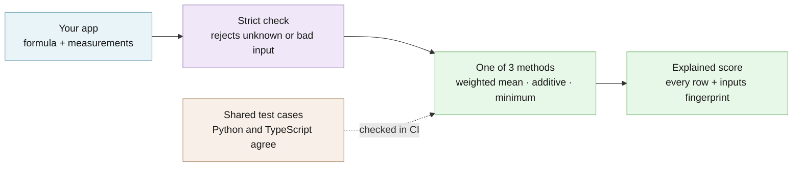

# Assay

Turns measurements on different scales into one score that shows its math — for developers who must explain a score.

[](https://github.com/hseshadr/assay/actions/workflows/dagger.yml)
[](https://github.com/hseshadr/assay/blob/main/CHANGELOG.md)
[](https://github.com/hseshadr/assay/blob/main/LICENSE)

[Docs](https://github.com/hseshadr/assay/blob/main/docs/ARCHITECTURE.md) · [Quickstart](https://github.com/hseshadr/assay/blob/main/QUICKSTART.md)

```text
input:  a laptop, measured three ways, each on its own scale
        battery life  10 hours   worst 0 hours,  best 20 hours   importance 2
        price         $900       worst $2,400,   best $400       importance 2
        weight        1.4 kg     worst 3.0 kg,   best 1.0 kg     importance 1

output: battery_hours    10 -> 0.50 of best × 40% share = 0.20
        price_usd       900 -> 0.75 of best × 40% share = 0.30
        weight_kg       1.4 -> 0.80 of best × 20% share = 0.16
        score: 0.66 out of 1
```
<sub>Real output of the example below.</sub>

## At a glance

- **What it does** — Like a spreadsheet column that adds up weighted grades, but every
  measurement keeps its own scale (hours, dollars, kilograms), "lower is better" is
  explicit, and every row of the arithmetic comes back with the score so anyone can
  replay it.
- **Who it's for** — A developer whose app grades or ranks things — laptops, vendors,
  job applicants, releases — and who has to answer "why did this one get 0.66?" with
  the exact numbers, the same way in Python and in TypeScript.
- **What stays on your device / what leaves it** — Stays: everything. Assay is a
  calculation library: it makes no network requests, and it writes a file only when
  you ask its command line to (`--out`). A test swaps the network socket for one that
  fails and still scores; the TypeScript package has zero runtime dependencies.
  Leaves: nothing. Results do keep your raw inputs, so treat them as carefully as the
  inputs themselves.
- **Runs on** — Python 3.13 or newer (`assay-engine` on PyPI) or Node.js 22.13 or newer
  (`@edgeproc/assay` on npm), on any operating system.
- **Not for** — Deciding whether a score is fair, whether the inputs are true, or where
  to draw the pass/fail line — your application owns those choices. It is also not a
  machine-learning model: it never learns weights from data.
- **Status** — Beta: the newest tag, `v0.5.0-dev.3`, is a prerelease (published as
  `assay-engine` 0.5.0.dev3 on PyPI and `@edgeproc/assay` 0.5.0-dev.3 on npm's `next`
  channel); there is no stable release yet. See
  [CHANGELOG](https://github.com/hseshadr/assay/blob/main/CHANGELOG.md).

## Try it in 60 seconds

Needs Python 3.13 or newer.

```bash
pip install assay-engine==0.5.0.dev3
```

Save this as `laptop.py` and run `python laptop.py`:

```python
from assay import compose, parse_request

def measure(name, value, worst, best, importance):
    direction = "higher_is_better" if best > worst else "lower_is_better"
    scale = {"minimum": min(worst, best), "maximum": max(worst, best), "direction": direction}
    return {"id": name, "label": name, "value": value, "scale": scale, "interval": None, "weight": importance}

laptop = [measure("battery_hours", 10, worst=0, best=20, importance=2),
          measure("price_usd", 900, worst=2400, best=400, importance=2),
          measure("weight_kg", 1.4, worst=3.0, best=1.0, importance=1)]
result = compose(parse_request({"method": "weighted_mean", "method_version": "laptop.v1",
                                "clamp": "reject", "components": laptop}))
for row in result.components:
    print(f"{row.id:<14}{row.raw:>5g} -> {row.normalized:.2f} of best × {row.coefficient:.0%} share = {row.contribution:.2f}")
print(f"score: {result.score:.2f} out of 1")
```

Its real output:

```text
battery_hours    10 -> 0.50 of best × 40% share = 0.20
price_usd       900 -> 0.75 of best × 40% share = 0.30
weight_kg       1.4 -> 0.80 of best × 20% share = 0.16
score: 0.66 out of 1
```

Each measurement is first placed between its worst and best value (0 = worst, 1 = best),
then multiplied by its share of the total importance (2 of 5 = 40%), and the shares are
added in the order you declared them. `result` also carries the method, a fingerprint of
the inputs for replay checks, and every intermediate number.

More runnable examples: [`examples/`](https://github.com/hseshadr/assay/tree/main/examples).

<!-- ======================== BELOW THE FOLD ======================== -->

## How it works

Your application declares the formula: a method, a version label for that formula, and
each measurement with its native scale. Assay's strict parser rejects anything unknown or
malformed before any arithmetic runs. The chosen method then combines the measurements in
the order you declared them, using ordinary 64-bit floating-point numbers. The result keeps
every input, every intermediate value, each row's contribution, and an order-preserving
fingerprint of the request, so the same request replays to the same numbers in Python and
TypeScript.



**[Explore the interactive architecture map →](https://github.com/hseshadr/assay/blob/main/docs/architecture/index.html)**
(Archify, generated from [`docs/architecture/runtime.architecture.json`](https://github.com/hseshadr/assay/blob/main/docs/architecture/runtime.architecture.json)).
Deep dive: [docs/ARCHITECTURE.md](https://github.com/hseshadr/assay/blob/main/docs/ARCHITECTURE.md).

### Source to artifact map

There are exactly two production source-to-artifact mappings:

```text
src/assay/  ──> assay-engine wheel ──> import assay
ts/src/     ──> @edgeproc/assay npm tarball ──> import "@edgeproc/assay"
```

`examples/`, `docs/`, `tests/`, and `testdata/` are repository support files, not
runtime packages. The Python package is the broader surface: composition is in the
base wheel, the command line uses the `cli` extra, and scientific calculators use the
`metrics` extra. The npm tarball provides composition plus a smaller set of optional
binary and ranking calculators.

This README is self-contained because the Python source distribution ships it, but
does not ship the repository's quickstart, docs, or examples; every link here therefore
points at the repository on GitHub.

## What you can do

- Combine measurements with a **weighted mean**, an **additive** formula, or a
  **minimum** (the weakest measurement decides) —
  [Methods](https://github.com/hseshadr/assay/blob/main/docs/METHODS.md)
- Replay and render a saved result's arithmetic from the command line with
  `assay explain` — [Quickstart](https://github.com/hseshadr/assay/blob/main/QUICKSTART.md)
- Get the same typed result from Python and TypeScript, proven by shared test cases —
  [Architecture](https://github.com/hseshadr/assay/blob/main/docs/ARCHITECTURE.md)
- Carry uncertainty through the formula as low/high intervals —
  [Methods](https://github.com/hseshadr/assay/blob/main/docs/METHODS.md)
- Compute optional binary-classification, ranking, calibration, and agreement reports —
  [Operations](https://github.com/hseshadr/assay/blob/main/docs/OPERATIONS.md)

## Why this and not X

| Alternative | Better when | Assay is better when |
|---|---|---|
| A few lines of your own arithmetic | The formula is tiny, private, and never questioned. | You must show the exact rows later, reject bad input consistently, or match the result in a second language. |
| A spreadsheet | People, not programs, do the scoring. | The score is computed inside software and must be replayable from its inputs. |
| A machine-learning model | You want weights learned from data. | The formula is written down and must stay exactly what you declared. |
| A hosted scoring service | You want someone else to run and tune it. | Inputs must stay in your process and the arithmetic must be inspectable. |

## Security and trust model

- **Verified:** every request against a strict contract — unknown fields, non-finite
  numbers, malformed identifiers, duplicate IDs, and invalid scales or intervals are
  rejected before arithmetic. `assay explain` re-checks a saved result's invariants
  before rendering it.
- **Refuses rather than warns:** an invalid request returns no partial score, only a
  stable, value-free `assay.*` error code; a result that fails its replay checks is
  refused rather than printed.
- **Not protected:** `inputs_hash` is a deterministic fingerprint, not authentication or
  tamper evidence. Assay does not check that inputs are true, fresh, or fair, and it does
  not protect results from anyone who can change them after scoring. Results contain raw
  input values.
- **Verify a release:** both registries publish build provenance from this repository's
  release workflow. Check npm with
  `npm view @edgeproc/assay@0.5.0-dev.3 dist.attestations`, and PyPI at
  `https://pypi.org/integrity/assay-engine/0.5.0.dev3/assay_engine-0.5.0.dev3-py3-none-any.whl/provenance`.

See [SECURITY.md](https://github.com/hseshadr/assay/blob/main/SECURITY.md) for reporting a
vulnerability.

## What this proves / what it does not prove

### Run the Northstar example

From the checkout root, run:

```bash
bash examples/run_composite.sh
```

The script builds the real Python wheel and npm tarball, installs each in an isolated
temporary environment, computes through both public package surfaces, checks every
typed field and binary64 value against the committed oracle, and prints one explanation:

```text
Northstar weighted score: 0.92
Method: weighted_mean @ northstar.2026-08-12
Interval: null — all inputs are deterministic

security       19/20  -> 0.950000 × 0.20 = 0.19
privacy        15/15  -> 1.000000 × 0.15 = 0.15
reliability    15/15  -> 1.000000 × 0.15 = 0.15
performance    12/15  -> 0.800000 × 0.15 = 0.12
correctness    15/15  -> 1.000000 × 0.15 = 0.15
clarity        14/15  -> 0.933333 × 0.15 = 0.14
production       2/5  -> 0.400000 × 0.05 = 0.02

Total: 0.92
inputs_hash: sha256:0266b1c59c97bacf85dc945685c55bb4386856b525249c7d5663a8edf020ba06
Parity: Python and TypeScript fields and values match
```

This is uncapped arithmetic only. Northstar hard caps, evidence grades, release
decisions, and other product policies remain outside Assay.

### How the score is calculated

The example declares seven components on three native scales. Assay first normalizes
each value to 0–1, divides its positive weight by the declared total of 100, then adds
the contributions in declaration order:

```text
security:    (19 - 0) / (20 - 0) × 20/100 = 0.19
privacy:     (15 - 0) / (15 - 0) × 15/100 = 0.15
reliability: (15 - 0) / (15 - 0) × 15/100 = 0.15
performance: (12 - 0) / (15 - 0) × 15/100 = 0.12
correctness: (15 - 0) / (15 - 0) × 15/100 = 0.15
clarity:     (14 - 0) / (15 - 0) × 15/100 = 0.14
production:  ( 2 - 0) / ( 5 - 0) ×  5/100 = 0.02
total:                                            0.92
```

### What this proves

For a validated request, the result exposes the selected method and version, preserves
the scored inputs in declaration order, shows every transformation and contribution,
and can be replayed under the same contract. The committed vectors prove the Python and
TypeScript composition surfaces agree semantically on all three methods and on the
exact request fingerprint. The claims are backed by:

- `bash examples/run_composite.sh` — builds both real packages and checks them against
  the committed oracle (above).
- `uv run poe gate` — lint, formatting, strict types, Grade A complexity, and the Python
  tests with at least 90% branch coverage.
- `corepack pnpm gate` in `ts/` — Biome, strict TypeScript, coverage, and the build.
- `uv run poe mutants` — deliberately breaks guards and requires their tests to fail.

### What this does not prove

Assay does not prove input truth, completeness, fairness, freshness, authenticity,
policy compliance, or decision quality. `inputs_hash` is a deterministic fingerprint,
not authentication or tamper evidence. A caller-declared method version records
provenance; it does not validate the methodology.

Application-owned bands, thresholds, hard gates, fairness review, abstention policy,
release decisions, and other downstream decisions remain application-owned. Results
retain raw values, so callers must treat them according to the sensitivity of their
inputs.

Python and TypeScript parity covers the three methods, typed field/value structure,
field and component order, IEEE-754 binary64 values, and the exact `inputs_hash`. It
does not promise byte-identical output from language-native JSON serializers; for
example, one serializer may spell the same number `19.0` and another `19`.

## Install

> **Status:** `assay-engine` 0.5.0.dev3 and `@edgeproc/assay` 0.5.0-dev.3 are the authorized prerelease pair, and both registries serve them.

Pin the exact prerelease on both registries:

```bash
pip install assay-engine==0.5.0.dev3
npm install @edgeproc/assay@0.5.0-dev.3
```

The base registry commands are `pip install assay-engine` and
`npm install @edgeproc/assay`, but pin the versions above for now: npm's default
`latest` channel still points at a do-not-install placeholder, and the prerelease is on
the `next` channel. Add extras for the command line and scientific calculators with
`pip install "assay-engine[cli,metrics]==0.5.0.dev3"`.

From a source checkout (Python 3.13, [uv](https://docs.astral.sh/uv/), Node 22.13.0 and
pnpm 11.5.0 for the TypeScript side), the build commands are in the
[quickstart](https://github.com/hseshadr/assay/blob/main/QUICKSTART.md).

## Usage & API

### Methods

Assay's portable typed API supports exactly three composition methods:

- `weighted_mean` normalizes components, converts positive declared weights into
  coefficients that sum to one, and adds their contributions.
- `additive` applies each raw term's explicit add or subtract operation and coefficient,
  then optionally clamps the final total.
- `minimum` normalizes components and selects the first lowest value, making declaration
  order the tie-breaker.

The method is chosen by the application because it owns the formula. Assay never
silently replaces a shipped formula with an average. See
[Methods](https://github.com/hseshadr/assay/blob/main/docs/METHODS.md) for validation,
uncertainty, and exact arithmetic rules.

### Python

Python 3.13 code imports `assay` from the distribution named `assay-engine`:

```python
from assay import compose, parse_request

request = parse_request(
    {
        "method": "minimum",
        "method_version": "service-health.v1",
        "components": [
            {
                "id": "availability",
                "label": "Availability",
                "value": 99.9,
                "scale": {"minimum": 99.0, "maximum": 100.0, "direction": "higher_is_better"},
                "interval": None,
                "weight": None,
            },
            {
                "id": "latency",
                "label": "Latency",
                "value": 180.0,
                "scale": {"minimum": 100.0, "maximum": 500.0, "direction": "lower_is_better"},
                "interval": None,
                "weight": None,
            },
        ],
        "clamp": "reject",
    }
)

result = compose(request)
print(result.score, result.selected_component_id)
```

### TypeScript

The npm package root exports the same `parseRequest()` and `compose()` pair; see the
[TypeScript README](https://github.com/hseshadr/assay/blob/main/ts/README.md).

### Command line

The command line accepts typed JSON for `assay compose`, `assay measure`, and
`assay explain`. Build and installation commands for the source checkout are in
the [quickstart](https://github.com/hseshadr/assay/blob/main/QUICKSTART.md).

### Result fields

Every result field is explicit:

| Field | Meaning |
|---|---|
| `schema` | Serialized result contract, currently `assay.result/v1`. |
| `method.id` | One of the three portable typed composition methods. |
| `method.version` | Caller-declared provenance for this formula revision. |
| `score` | Final finite binary64 result. |
| `interval` | Propagated uncertainty bounds, or `null` for deterministic inputs. |
| `clamp` | Requested boundary policy, or `null` only for unclamped additive scoring. |
| `intercept` | Additive starting value; `null` for the other methods. |
| `weight_total` | Weighted-mean declared weight total; otherwise `null`. |
| `components` | Ordered arithmetic rows retained for replay. |
| `id` | Stable input identifier for one row. |
| `raw` | Original finite input value; it may be sensitive. |
| `normalized` | 0–1 transformed value, or `null` for additive rows. |
| `declared_weight` | Original weighted-mean weight, otherwise `null`. |
| `operation` | `add` or `subtract`; normalized methods use `add`. |
| `coefficient` | Effective multiplier used for the row. |
| `contribution` | Pre-operation product: `normalized × coefficient` or `raw × coefficient`. For additive rows, `operation` controls how it changes the running total. |
| `contribution_interval` | Row uncertainty contribution, or `null`. |
| `inputs_hash` | Order-preserving request fingerprint used for replay comparison. |
| `selected_component_id` | Minimum-method bottleneck ID; otherwise `null`. |

### Legacy Python compatibility

The wheel retains a Python-only migration adapter at the deep import `assay.composite`:
`SubScore` plus `composite(...)`. It is not exported from the package root, does not
return the typed method or `inputs_hash` fields, and has no TypeScript equivalent. For
all new code, use package-root `parse_request()` and `compose()` with one of the three
portable methods above.

### Optional calculators

Python's optional scientific surface calculates typed binary-classification, ranking,
calibration, agreement, and uncertainty reports. TypeScript exposes a smaller binary
and ranking calculator set. Complete optional-metric parity is not claimed, and the
calculator resource ceilings do not limit core composition. See
[Methods](https://github.com/hseshadr/assay/blob/main/docs/METHODS.md) and
[Operations](https://github.com/hseshadr/assay/blob/main/docs/OPERATIONS.md) for the
exact boundary.

## Optional integration

Assay computes scores; Avow seals evidence. They are separate products in separate repositories, and neither imports or requires the other. The already-published `avow` 0.4.1 and `@edgeproc/avow` 0.4.1 artifacts remain unchanged.

An application may pass an ordinary Assay result to a separately selected evidence
system. That adapter belongs to the application or to its own versioned integration
package, never to either core scoring package.

## Configuration

Core composition has no configuration: everything it uses is in the request, and it
needs no credentials. The optional calculators take their controls in the typed
measurement request; these are the defaults. The legacy settings API also reads them
from `ASSAY_`-prefixed environment variables, only when that optional surface is
constructed.

| Control | Environment variable | Default | What it changes |
|---|---|---:|---|
| `min_samples` | `ASSAY_MIN_SAMPLES` | 30 | Fewest samples before an interval is reported; below it Assay abstains |
| `bootstrap_resamples` | `ASSAY_BOOTSTRAP_RESAMPLES` | 9,999 | Resamples for bootstrap confidence intervals |
| `confidence_level` | `ASSAY_CONFIDENCE_LEVEL` | 0.95 | Width of those intervals |
| `ece_bins` | `ASSAY_ECE_BINS` | 15 | Calibration bins |
| `bootstrap_seed` | `ASSAY_BOOTSTRAP_SEED` | 12,345 | Seed that makes resampling repeatable |
| `ranking_k` | `ASSAY_RANKING_K` | 10 | Ranking depth ("first page") |

Limits for each control are in
[Operations](https://github.com/hseshadr/assay/blob/main/docs/OPERATIONS.md).

## Limitations & roadmap

**Shipped:** the three portable methods, strict request parsing, interval propagation,
the `assay` command line, Python optional calculators, and the smaller TypeScript
calculator set, in the `v0.5.0-dev.3` prerelease.

**Planned (not shipped):** a stable 0.5.0 release of both packages. Complete
optional-metric parity between Python and TypeScript is not planned or claimed. See
[CHANGELOG](https://github.com/hseshadr/assay/blob/main/CHANGELOG.md).

## Getting help

- **GitHub Issues** — Best for: bugs and concrete feature requests —
  [open an issue](https://github.com/hseshadr/assay/issues).
- **Private security advisory** — Best for: security reports; see
  [SECURITY.md](https://github.com/hseshadr/assay/blob/main/SECURITY.md). Never use a
  public issue for a vulnerability.

## Contributing / development

Run both complete language gates (CI runs them inside its Dagger check):

```bash
uv run poe gate && (cd ts && corepack pnpm gate)
```

The TypeScript gate needs Node 22.13.0 and pnpm 11.5.0; the exact toolchain commands and
the release, audit, and security tasks are in
[CLAUDE.md](https://github.com/hseshadr/assay/blob/main/CLAUDE.md) and the
[quickstart](https://github.com/hseshadr/assay/blob/main/QUICKSTART.md). Work red → green →
refactor: a behavior change starts with a failing test.

## License / Citation

MIT © Harish Seshadri — see
[LICENSE](https://github.com/hseshadr/assay/blob/main/LICENSE).
