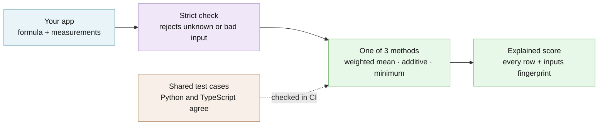

# Assay architecture

> **TL;DR:** Assay has two independent production packages with one shared semantic
> scoring contract. Repository support files do not become runtime packages.

## Overview

Your application declares the formula: a method, a version label for that formula, and
each measurement with its native scale. The strict parser rejects anything unknown or
malformed before any arithmetic runs. The chosen method then combines the measurements in
the order you declared them, using ordinary 64-bit floating-point numbers. The result keeps
every input, every intermediate value, each row's contribution, and an order-preserving
fingerprint of the request, so the same request replays to the same numbers in Python and
TypeScript.



The [interactive architecture map](architecture/index.html) is generated from
[`architecture/runtime.architecture.json`](architecture/runtime.architecture.json).

## Source to artifact map

Exactly two production source trees ship:

```text
src/assay/  ──> assay-engine wheel ──> import assay
ts/src/     ──> @edgeproc/assay npm tarball ──> import "@edgeproc/assay"
```

- `examples/` demonstrates installed artifacts.
- `docs/` explains contracts and operations.
- `tests/` enforces Python, documentation, artifact, and parity behavior.
- `testdata/` holds shared language-neutral vectors.

Those four directories support the repository. They are not a third production source
tree and do not create another import package.

## Core data flow

```text
unknown JSON
    │
    ▼
strict request parser ──> typed weighted_mean | additive | minimum request
    │
    ▼
declared-order finite binary64 arithmetic
    │
    ├──> ordered component explanations
    ├──> propagated interval or null
    └──> order-preserving inputs_hash
             │
             ▼
         ScoreResult
```

The public parser is the boundary. It rejects unknown fields, nonfinite numbers,
malformed identifiers, duplicate component IDs, invalid scales or intervals, and
method-specific shape errors before arithmetic. Requests are immutable after parsing.

The method version is caller-declared provenance. Assay includes it in the request
fingerprint but does not interpret whether that version describes a good formula.

## Portable composition core

Both packages implement the same three methods:

- weighted mean: normalize, divide positive weights by their declared total, combine;
- additive: multiply raw values by nonnegative coefficients, apply explicit signs in
  order, then apply the optional final boundary;
- minimum: normalize and choose the first lowest component.

Both surfaces preserve field order, component order, binary64 results, and the exact
`inputs_hash` for shared vectors. The fingerprint comes from a deterministic internal
request encoding; it is not a claim about the bytes emitted by a language-native JSON
serializer. [Methods](METHODS.md) defines the complete contract.

## Legacy Python compatibility

The wheel also retains the Python-only deep import `assay.composite` for callers still
using `SubScore` and `composite(...)`. That migration adapter is not exported from the
package root, does not return the portable typed method or `inputs_hash` fields, and is
absent from TypeScript. For all new code, use package-root `parse_request()` and
`compose()` with weighted mean, additive, or minimum.

## Python package

The `assay-engine` base wheel depends only on Pydantic and includes contracts,
normalization, composition, replay validation, and stable errors. The `cli` extra adds
Typer for `assay compose`, `assay measure`, and `assay explain`. The `metrics` extra
adds NumPy, SciPy, scikit-learn, ir-measures, and settings support.

Optional dependencies load only at optional entry points. Base composition works in a
clean environment without the scientific stack. Missing extras fail with stable Assay
error codes instead of leaking dependency exceptions.

## TypeScript package

The `@edgeproc/assay` tarball ships only compiled `dist/` output and has no runtime
dependencies. Package-root exports provide strict request/result parsers, normalization,
the three combiners, stable errors, and a smaller set of binary and ranking calculators.

The TypeScript source never imports the Python package. Shared vectors, not a runtime
bridge, prove semantic agreement.

## Application boundary

Applications select the formula and method version, supply measurements and scales,
interpret the result, and own any bands, thresholds, hard gates, fairness review,
abstention rules, or decisions. Assay validates and explains declared arithmetic; it
does not replace application policy.

An application may pass an ordinary Assay result to a separately selected evidence
system. That adapter belongs to the application or to its own versioned integration
package, never to either core scoring package.

The engine performs no implicit persistence or runtime network I/O. The command-line
adapter is the only core surface that reads or writes files, and it does so only for
paths explicitly supplied by the operator. [Operations](OPERATIONS.md) defines that
boundary.

## What the checks cover

- **Checked:** every request against a strict contract. Unknown fields, non-finite
  numbers, malformed identifiers, duplicate IDs, and invalid scales or intervals are
  rejected before arithmetic. `assay explain` re-checks a saved result's invariants
  before rendering it.
- **Refuses rather than warns:** an invalid request returns no partial score, only a
  stable, value-free `assay.*` error code. A result that fails its replay checks is
  refused rather than printed.
- **Not protected:** `inputs_hash` is a deterministic fingerprint, not authentication or
  tamper evidence. Assay does not check that inputs are true, fresh, or fair, and it does
  not protect results from anyone who can change them after scoring. Results contain raw
  input values.
- **Verify a release:** both registries publish build provenance from this repository's
  release workflow. Check npm with
  `npm view @edgeproc/assay@0.5.0-dev.3 dist.attestations`, and PyPI at
  `https://pypi.org/integrity/assay-engine/0.5.0.dev3/assay_engine-0.5.0.dev3-py3-none-any.whl/provenance`.

## Cross-language example: build both packages and compare

From the checkout root, run:

```bash
bash examples/run_composite.sh
```

The script builds the real Python wheel and npm tarball, installs each in an isolated
temporary environment, computes through both public package surfaces, checks every
typed field and binary64 value against the committed oracle, and prints one explanation:

```text
Northstar weighted score: 0.92
Method: weighted_mean @ northstar.2026-08-12
Interval: null — all inputs are deterministic

security       19/20  -> 0.950000 × 0.20 = 0.19
privacy        15/15  -> 1.000000 × 0.15 = 0.15
reliability    15/15  -> 1.000000 × 0.15 = 0.15
performance    12/15  -> 0.800000 × 0.15 = 0.12
correctness    15/15  -> 1.000000 × 0.15 = 0.15
clarity        14/15  -> 0.933333 × 0.15 = 0.14
production       2/5  -> 0.400000 × 0.05 = 0.02

Total: 0.92
inputs_hash: sha256:0266b1c59c97bacf85dc945685c55bb4386856b525249c7d5663a8edf020ba06
Parity: Python and TypeScript fields and values match
```

This is uncapped arithmetic only. Northstar hard caps, evidence grades, release
decisions, and other product policies remain outside Assay.

### How the example score is calculated

The example declares seven components on three native scales. Assay first normalizes
each value to 0–1, divides its positive weight by the declared total of 100, then adds
the contributions in declaration order:

```text
security:    (19 - 0) / (20 - 0) × 20/100 = 0.19
privacy:     (15 - 0) / (15 - 0) × 15/100 = 0.15
reliability: (15 - 0) / (15 - 0) × 15/100 = 0.15
performance: (12 - 0) / (15 - 0) × 15/100 = 0.12
correctness: (15 - 0) / (15 - 0) × 15/100 = 0.15
clarity:     (14 - 0) / (15 - 0) × 15/100 = 0.14
production:  ( 2 - 0) / ( 5 - 0) ×  5/100 = 0.02
total:                                            0.92
```

### What the example proves

For a validated request, the result exposes the selected method and version, preserves
the scored inputs in declaration order, shows every transformation and contribution,
and can be replayed under the same contract. The committed vectors prove the Python and
TypeScript composition surfaces agree semantically on all three methods and on the
exact request fingerprint. The claims are backed by:

- `bash examples/run_composite.sh` — builds both real packages and checks them against
  the committed oracle (above).
- `uv run poe gate` — lint, formatting, strict types, Grade A complexity, and the Python
  tests with at least 90% branch coverage.
- `corepack pnpm gate` in `ts/` — Biome, strict TypeScript, coverage, and the build.
- `uv run poe mutants` — deliberately breaks guards and requires their tests to fail.

### What the example does not prove

Assay does not prove input truth, completeness, fairness, freshness, authenticity,
policy compliance, or decision quality. `inputs_hash` is a deterministic fingerprint,
not authentication or tamper evidence. A caller-declared method version records
provenance; it does not validate the methodology.

Application-owned bands, thresholds, hard gates, fairness review, abstention policy,
release decisions, and other downstream decisions remain application-owned. Results
retain raw values, so callers must treat them according to the sensitivity of their
inputs.

Python and TypeScript parity covers the three methods, typed field/value structure,
field and component order, IEEE-754 binary64 values, and the exact `inputs_hash`. It
does not promise byte-identical output from language-native JSON serializers; for
example, one serializer may spell the same number `19.0` and another `19`.

## Python API example

The `minimum` method scores a service by its weakest measurement:

```python
from assay import compose, parse_request

request = parse_request(
    {
        "method": "minimum",
        "method_version": "service-health.v1",
        "components": [
            {
                "id": "availability",
                "label": "Availability",
                "value": 99.9,
                "scale": {"minimum": 99.0, "maximum": 100.0, "direction": "higher_is_better"},
                "interval": None,
                "weight": None,
            },
            {
                "id": "latency",
                "label": "Latency",
                "value": 180.0,
                "scale": {"minimum": 100.0, "maximum": 500.0, "direction": "lower_is_better"},
                "interval": None,
                "weight": None,
            },
        ],
        "clamp": "reject",
    }
)

result = compose(request)
print(result.score, result.selected_component_id)
```

The command line (`pip install "assay-engine[cli]"`) accepts typed JSON for
`assay compose`, `assay measure`, and `assay explain`; see the
[quickstart](../QUICKSTART.md). Every result field is defined in [Methods](METHODS.md).

## Optional calculators

Python's optional scientific surface (`pip install "assay-engine[metrics]"`) calculates
typed binary-classification, ranking, calibration, agreement, and uncertainty reports.
TypeScript exposes a smaller binary and ranking calculator set. Complete optional-metric
parity is not claimed, and the calculator resource ceilings do not limit core
composition. Controls and limits are in [Operations](OPERATIONS.md).

## Status and roadmap

**Shipped:** the three portable methods, strict request parsing, interval propagation,
the `assay` command line, Python optional calculators, and the smaller TypeScript
calculator set, in the `v0.5.0-dev.3` prerelease.

**Planned (not shipped):** a stable 0.5.0 release of both packages. Complete
optional-metric parity between Python and TypeScript is not planned or claimed. See the
[CHANGELOG](../CHANGELOG.md).
